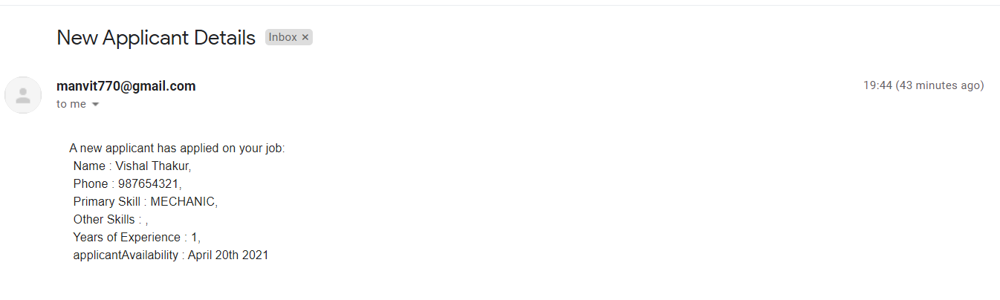

<div align="center">

# 🎨 JobEase Frontend

**Modern React Application for Blue Collar Job Search Platform**

[](https://reactjs.org/)
[](https://javascript.com/)
[](https://css3.com/)


</div>

---

## 📋 Table of Contents

- [✨ Features](#-features)
- [🛠️ Tech Stack](#️-tech-stack)
- [🚀 Quick Start](#-quick-start)
- [🎨 UI Components](#-ui-components)
- [🌍 Internationalization](#-internationalization)
- [📱 Responsive Design](#-responsive-design)
- [📁 Project Structure](#-project-structure)
- [🧪 Testing](#-testing)
- [🚧 Development](#-development)

## ✨ Features

### 🎯 Core User Experience
- ✅ **Intuitive Interface** - Designed for less tech-savvy users
- ✅ **One-Click Applications** - Simplified job application process
- ✅ **Category-based Navigation** - Easy job category selection
- ✅ **Mobile-first Design** - Optimized for smartphone usage
- ✅ **Multi-language Support** - Bengali, Hindi, Kannada, Marathi, Telugu
- ✅ **Voice Recognition** - Accessibility features for better usability
- ✅ **Progressive Web App** - App-like experience on mobile devices

### 🏢 For Job Seekers
- 📝 **Quick Registration** - Minimal form fields
- 👤 **Profile Management** - Easy profile updates
- 🔍 **Job Discovery** - Browse jobs by category
- 📱 **Application Tracking** - View application status
- 🔔 **Notifications** - Real-time updates

### 👔 For Employers
- 📋 **Job Posting** - Simple job creation interface
- 👥 **Candidate Management** - View and filter applicants
- 📊 **Dashboard** - Application analytics
- 📞 **Direct Contact** - Connect with candidates instantly

> **📱 Note**: SMS notifications are currently limited to Twilio verified numbers (development environment)

## 🛠️ Tech Stack

### Frontend Framework
-  **React.js 18+** - Modern UI library
-  **ES6+** - Modern JavaScript features
-  **CSS Modules** - Scoped styling

### Development Tools
-  **Create React App** - Development environment
-  **React i18next** - Internationalization
-  **Service Worker** - Progressive Web App features

### Deployment
-  **Vercel** - Frontend hosting
-  **CDN** - Asset optimization

## 🚀 Quick Start

### Prerequisites

- Node.js 16+ and npm
- Access to JobEase Backend API
- Modern web browser

### Installation

1. **Clone the repository**
   ```bash
   git clone https://github.com/your-username/jobease-frontend.git
   cd jobease-frontend
   ```

2. **Install dependencies**
   ```bash
   npm install
   ```

3. **Environment Configuration**
   
   Create a `.env` file in the root directory:
   ```env
   # API Configuration
   REACT_APP_API_BASE_URL=http://localhost:5000
   REACT_APP_API_TIMEOUT=30000
   
   # Feature Flags
   REACT_APP_VOICE_RECOGNITION=true
   REACT_APP_PWA_ENABLED=true
   
   # Analytics (Optional)
   REACT_APP_GA_TRACKING_ID=your_ga_tracking_id
   ```

4. **Start development server**
   ```bash
   npm start
   ```

5. **Build for production**
   ```bash
   npm run build
   ```

6. **Preview production build**
   ```bash
   npm run serve
   ```

### Development Server

- **Local**: `http://localhost:3000`
- **Network**: Access from mobile devices on same network
- **Hot Reload**: Automatic refresh on file changes

## 🎨 UI Components

### Core Components Architecture

```
🏗️ Component Structure
├── 🏠 HomePage/               # Landing page component
├── 📝 ApplyJob/               # Job application interface
├── 👤 UserProfile/            # User profile management
├── 🔍 ViewOpportunity/        # Job listings display
├── 👥 ViewCandidates/         # Candidate profiles for employers
├── 📋 PostOpportunity/        # Job posting interface
├── 🌐 LanguageSelector/       # Multi-language switching
├── 🎤 VoiceRecognition/       # Voice input features
└── 🦶 Footer/                 # Site footer
```

### Component Features

| Component | Purpose | Features |
|:----------|:--------|:---------|
| **HomePage** | Landing & navigation | Category selection, hero banner |
| **ApplyJob** | Job applications | One-click apply, form validation |
| **UserProfile** | Profile management | Edit info, skill updates |
| **ViewOpportunity** | Job discovery | Filter by category, job details |
| **ViewCandidates** | Employer dashboard | Candidate search, contact info |
| **PostOpportunity** | Job creation | Form wizard, preview |
| **LanguageSelector** | Localization | 5 language support |
| **VoiceRecognition** | Accessibility | Voice input for search |

### Supported Job Categories

<div align="center">

| Category | Component | Icon | Description |
|:---------|:----------|:----:|:------------|
| Electrician | `ElectricianCard` | ⚡ | Electrical installations & repair |
| Plumber | `PlumberCard` | 🔧 | Water systems & pipe work |
| Labour | `LabourCard` | 👷 | Construction & manual work |
| Driver | `DriverCard` | 🚗 | Transportation services |
| Maid | `MaidCard` | 🏠 | Domestic help services |
| Security Guard | `SecurityCard` | 🛡️ | Security & surveillance |
| Cook | `CookCard` | 👨‍🍳 | Food preparation services |
| Peon | `PeonCard` | 📋 | Office assistance |
| Mechanic | `MechanicCard` | 🔩 | Vehicle & machinery repair |

</div>

## 🌍 Internationalization

### Supported Languages

The application supports 5 major Indian languages:

| Language | Code | Status | Progress |
|:---------|:-----|:-------|:---------|
| English | `en` | ✅ Complete | 100% |
| Hindi | `hn` | ✅ Complete | 100% |
| Bengali | `bengali` | ✅ Complete | 100% |
| Kannada | `kannada` | ✅ Complete | 100% |
| Marathi | `marathi` | ✅ Complete | 100% |
| Telugu | `telugu` | ✅ Complete | 100% |

### Translation Files

```
public/assets/i18n/translations/
├── en.json          # English (default)
├── hn.json          # Hindi
├── bengali.json     # Bengali
├── kannada.json     # Kannada
├── marathi.json     # Marathi
└── telugu.json      # Telugu
```

### Usage Example

```javascript
import { useTranslation } from 'react-i18next';

function JobCard() {
  const { t } = useTranslation();
  
  return (
    <div>
      <h3>{t('job.title')}</h3>
      <p>{t('job.description')}</p>
      <button>{t('job.apply')}</button>
    </div>
  );
}
```

## 📱 Responsive Design

### Breakpoints

```css
/* Mobile First Approach */
.container {
  /* Mobile: 320px - 768px */
  padding: 1rem;
}

@media (min-width: 768px) {
  /* Tablet: 768px - 1024px */
  .container {
    padding: 2rem;
  }
}

@media (min-width: 1024px) {
  /* Desktop: 1024px+ */
  .container {
    padding: 3rem;
    max-width: 1200px;
    margin: 0 auto;
  }
}
```

### CSS Modules Structure

```
src/CSS/
├── ApplyJob.module.css         # Job application styles
├── Banner.module.css           # Hero banner styles
├── Footer.module.css           # Footer component styles
├── Form.module.css             # Form component styles
├── HomePage.module.css         # Homepage styles
├── Navbar.module.css           # Navigation styles
├── ModernApplyJob.module.css   # Enhanced apply job styles
├── ModernFooter.module.css     # Modern footer design
├── ModernForm.module.css       # Modern form styling
├── ModernHomePage.module.css   # Modern homepage design
├── ModernNavbar.module.css     # Modern navigation
└── Procedure.module.css        # Process flow styles
```

## 📁 Project Structure

```
frontend/
├── 📄 package.json             # Dependencies and scripts
├── 📁 public/                  # Static assets
│   ├── index.html              # HTML template
│   ├── manifest.json           # PWA manifest
│   ├── _redirects              # Deployment redirects
│   └── assets/
│       └── i18n/               # Translation files
├── 📁 src/                     # Source code
│   ├── 📄 App.js               # Main application component
│   ├── 📄 index.js             # Application entry point
│   ├── 📄 i18n.js              # Internationalization setup
│   ├── 📄 serviceWorker.js     # PWA service worker
│   ├── 📁 Components/          # React components
│   │   ├── ApplyJob/
│   │   ├── Footer/
│   │   ├── HomePage/
│   │   ├── LanguageSelector/
│   │   ├── PostOpportunity/
│   │   ├── UserProfile/
│   │   ├── ViewCandidates/
│   │   ├── ViewOpportunity/
│   │   └── VoiceRecognition/
│   ├── 📁 CSS/                 # Component styles
│   └── 📁 Assets/              # Images and icons
│       ├── banner.svg
│       ├── logo.PNG
│       └── job-category-icons/
└── 📁 build/                   # Production build output
```

## 🧪 Testing

### Available Scripts

```bash
# Run unit tests
npm test

# Run tests with coverage
npm test -- --coverage

# Run tests in watch mode
npm test -- --watch

# Run end-to-end tests
npm run test:e2e
```

### Testing Strategy

| Test Type | Framework | Coverage |
|:----------|:----------|:---------|
| Unit Tests | Jest + React Testing Library | Components |
| Integration Tests | Jest | API integration |
| E2E Tests | Cypress (planned) | User workflows |
| Visual Tests | Storybook (planned) | Component library |

## 🚧 Development

### User Workflow

#### 👤 Job Seeker Journey
1. **Landing Page** → Select job category or use voice search
2. **Registration** → Quick profile creation (name, phone, category)
3. **Browse Jobs** → View available opportunities by category
4. **Apply** → One-click application with profile auto-fill
5. **Confirmation** → SMS notification sent automatically

   

#### 🏢 Employer Journey
1. **Post Job** → Create detailed job listing
2. **Publish** → Job goes live instantly
3. **Receive Applications** → Email notifications for new applicants
4. **Review Candidates** → Browse applicant profiles
5. **Contact** → Direct communication with candidates

   

### Development Scripts

```bash
# Development
npm start              # Start development server
npm run dev            # Alias for start

# Building
npm run build          # Create production build
npm run build:analyze  # Analyze bundle size

# Code Quality
npm run lint           # Run ESLint
npm run lint:fix       # Fix linting issues
npm run format         # Format code with Prettier

# Testing
npm test               # Run tests
npm run test:coverage  # Run with coverage
npm run test:watch     # Watch mode

# Deployment
npm run deploy         # Deploy to Vercel
npm run preview        # Preview production build
```

### Browser Support

| Browser | Version | Support |
|:--------|:--------|:--------|
| Chrome | 80+ | ✅ Full |
| Firefox | 75+ | ✅ Full |
| Safari | 13+ | ✅ Full |
| Edge | 80+ | ✅ Full |
| Mobile Safari | iOS 13+ | ✅ Full |
| Chrome Mobile | Android 8+ | ✅ Full |

### Performance Optimizations

- **Code Splitting** - Lazy loading of route components
- **Image Optimization** - WebP format with fallbacks
- **Bundle Analysis** - Webpack bundle analyzer integration
- **Caching Strategy** - Service worker for offline functionality
- **CSS Optimization** - CSS Modules for minimal bundle size

### Accessibility Features

- **Screen Reader Support** - ARIA labels and semantic HTML
- **Keyboard Navigation** - Full keyboard accessibility
- **High Contrast Mode** - Support for visual impairments
- **Voice Recognition** - Voice input for search and navigation
- **Simple Language** - Clear, non-technical terminology

### Known Issues & Roadmap

<details>
<summary>🔧 Current Limitations & Future Plans</summary>

#### Current Limitations
- **Authentication** - No user login system yet
- **Offline Mode** - Limited offline functionality
- **Real-time Updates** - No WebSocket integration
- **File Uploads** - No image upload for profiles

#### Phase 2 Roadmap
- [ ] **User Authentication** - JWT-based login system
- [ ] **Real-time Notifications** - WebSocket integration
- [ ] **Advanced Search** - Location and salary filters
- [ ] **Profile Pictures** - Image upload functionality
- [ ] **Chat System** - In-app messaging

#### Phase 3 Future
- [ ] **Mobile App** - React Native version
- [ ] **Video Profiles** - Video introduction feature
- [ ] **AI Recommendations** - Smart job matching
- [ ] **Payment Integration** - Premium features

</details>

---

<div align="center">

**Crafted with ❤️ to empower blue-collar workers**

[⬆ Back to Top](#-jobease-frontend)

</div>
